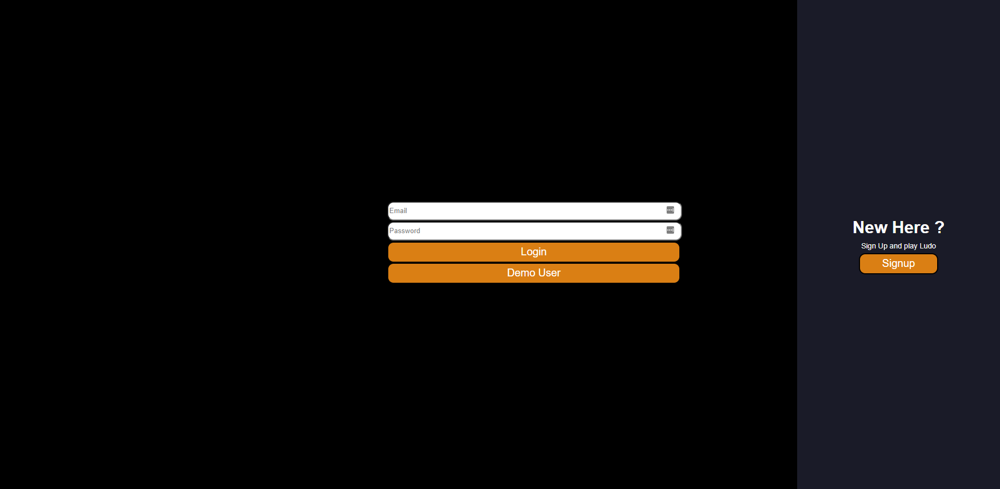
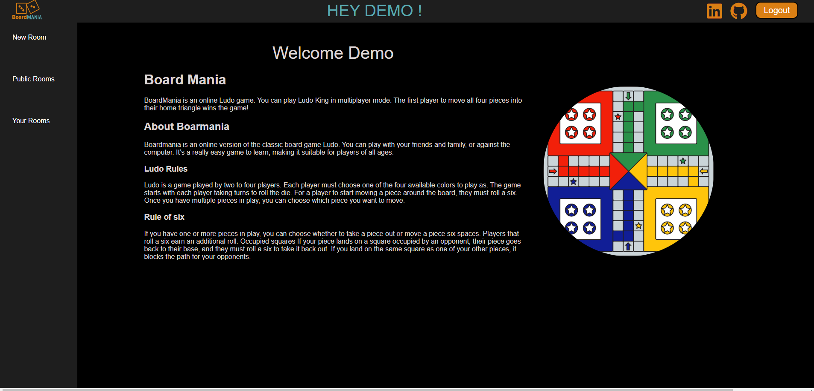
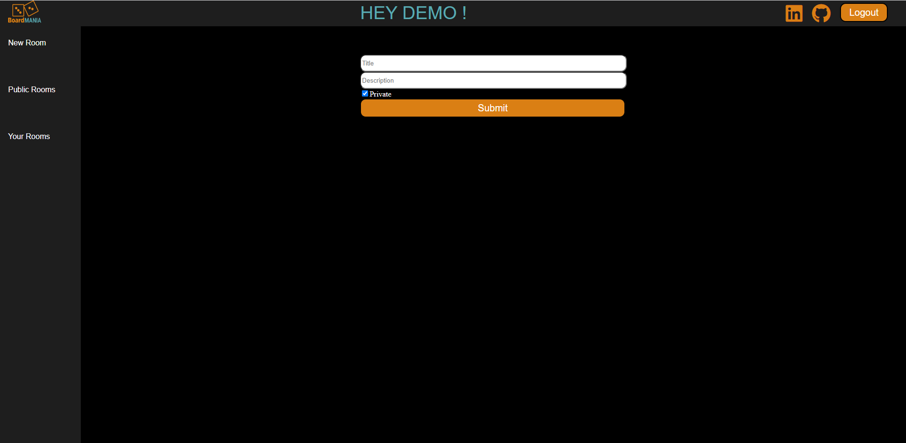
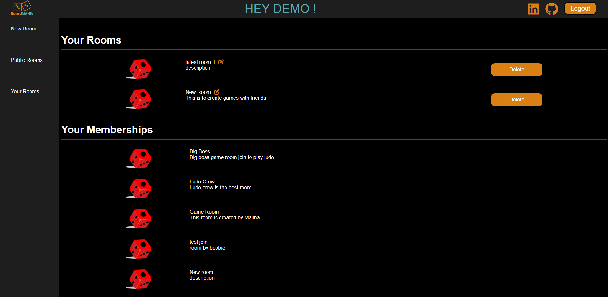
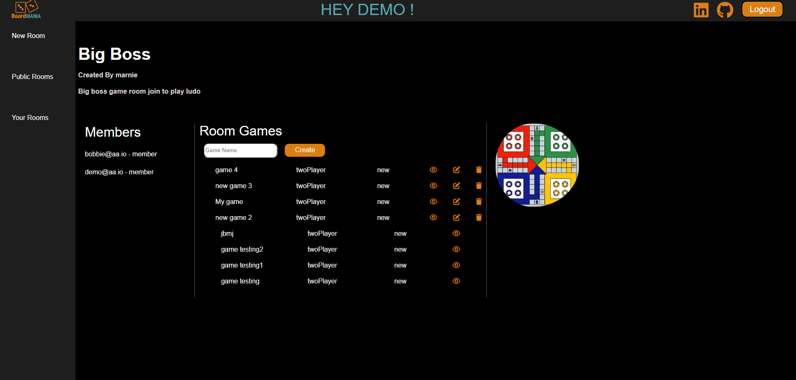
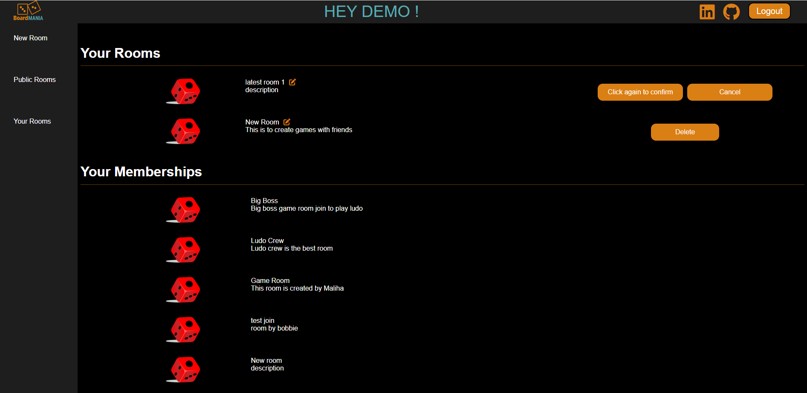
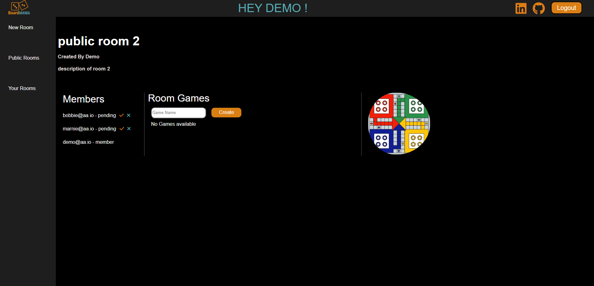
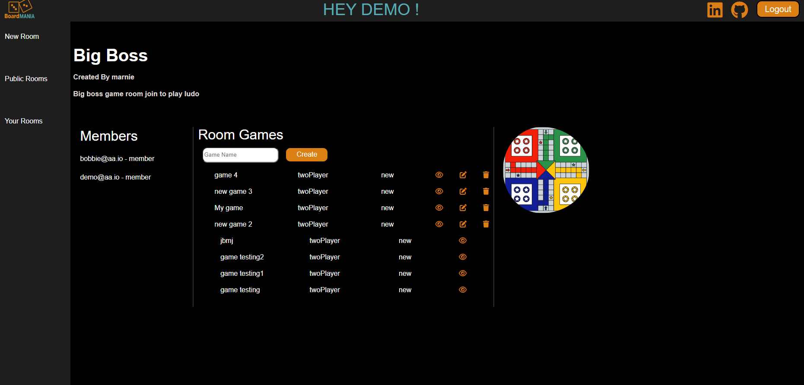
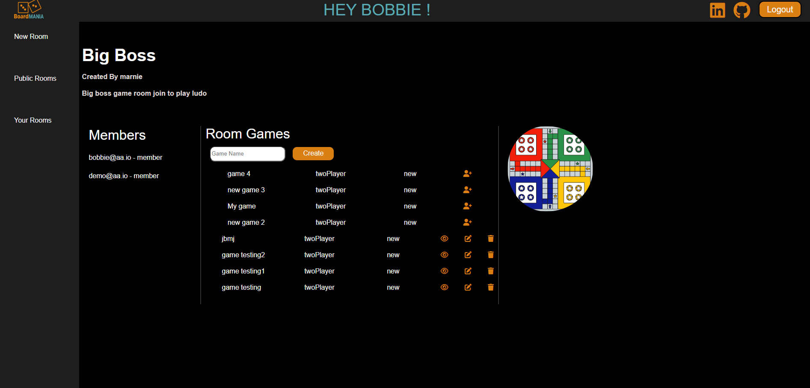
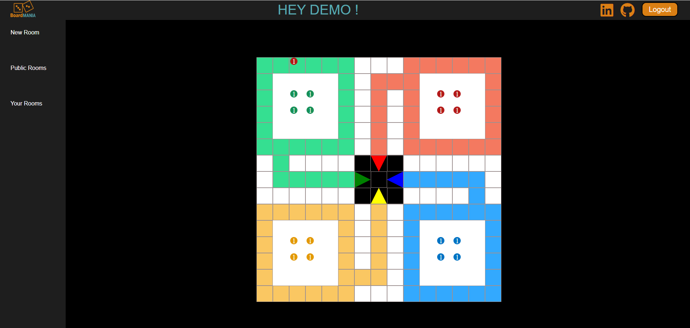

# Boardmania

Boardmania is a web based board game. It allows user to create rooms and join rooms of intereset. Once user has joined a room they can start games and play with friends. User can accept or reject membership request. 

# List of techs/languages/plugins/APIs used
- React.js
- JSON API
- FLASK
- PostgreSQL
- CSS
- Web sockets
- Heroku
- HTML
- SQLalchemy 

# Landing Page

The website requires login to use any feature. When user opens the website first page they see is login or signup page. 

# Splash Page/ Home Page

When a user is logged in or signed up, they'll be able to see splash page where they can read game rules and about boardmania.

# New Room 

A logged in user can create new room. Room name should be unique. User can view their newly created room in your rooms. Other users can get membership of these rooms by clicking on their public rooms. 

# View rooms

A logged in user can view their rooms by clicking on your rooms in left side menu of the website. There rooms are divided in two parts. Their created rooms and rooms in which they have membership. 

# view single room

A logged in user can click on their room to view details of that room. Their they can see all members on left side. In center they can create, edit or delete games. 

# Edit Room

A logged in user can edit their own created rooms by clicking on small edit icon in front of list of rooms in your room page. 

# Delete Room 

A logged in user can delete their created rooms by clicking delete button in front of room in your rooms list. User will be asked for confirmation before deleting the room.

# Memberships 

A logged in user can view their membership by clicking on "your rooms" on left side of page menu. User cannot edit the rooms created by others. 

# Accept/reject memberships 

A user can accept membership to their created room by clicking on tick or cross next to email address of members. If user selects to reject the membership it will delete the membership. The accepted members will be added in room and can create, play or view games in that room. 

# Create game 

A member of room or room owner can create games in that room. Game name should be unique. 

# Edit game

A user who created the game can only edit that game. Edit game can be done by two ways. Either by clicking on small edit icon next to that game or by clicking on game name. 

# Delete game

Only owner of game can delete the game by clicking on delete icon next to game. Delete and edit icon is not visible for users who are not owner of the game. 

# join game

A user can click on join game if there is only one player as only 2 player can play the game. The join icon will turn into view game if there are two players already playing the game. 

# View game

A user can view game or play game by clicking on eye next to that game. 

